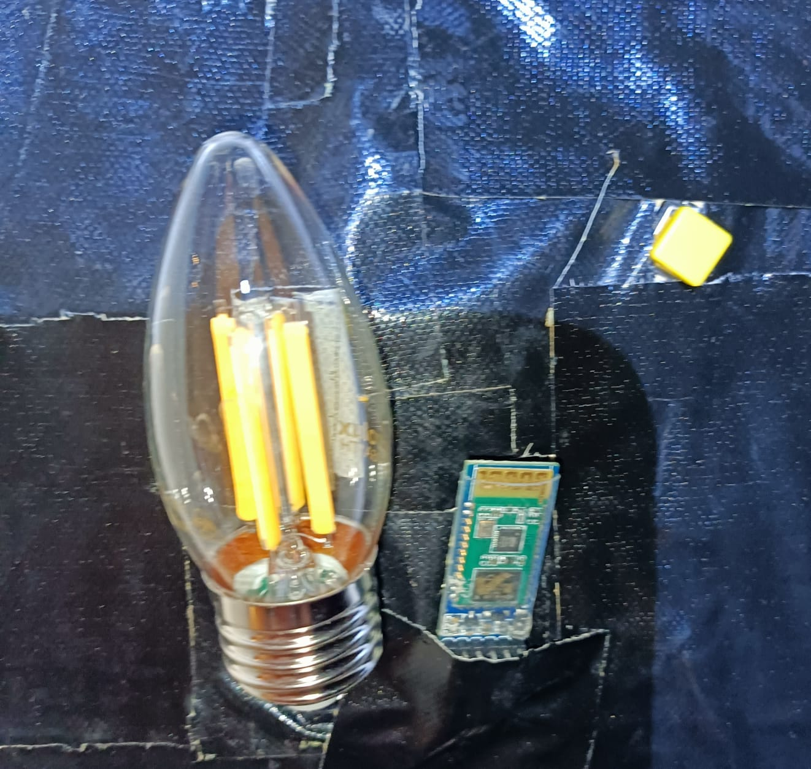
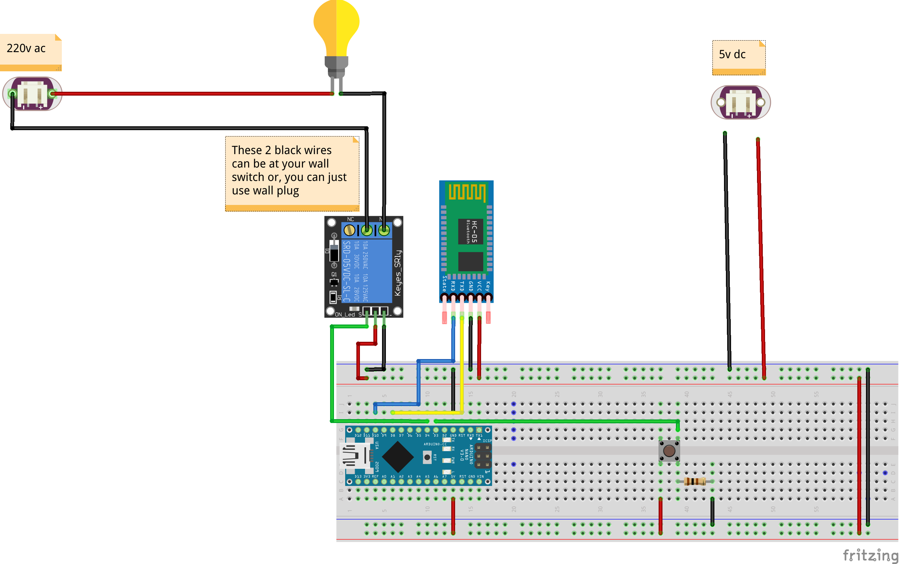

 <h1>Bluetooth Light Switch</h1>
 
  
 
Have you ever found yourself lying in bed, yearning to switch off the light without having to get up and move? 
Well, we have the perfect solution for you! Introducing our innovative project: The Bluetooth light switch. 

 
 <h1>Components</h1>
 <ul>
 <li><a href="https://www.newark.com/arduino/a000005/dev-board-atmega328-arduino-nano/dp/13T9275?COM=ref_hackster">Arduino NANO</a></li>
 <li><a href="https://www.newark.com/apem/mjtp1230/switch-tactile-spst-50ma-through/dp/19C7994?COM=ref_hackster">Tactile Switch</a></li>
 <li><a href="https://www.amazon.com/HiLetgo-Wireless-Bluetooth-Transceiver-Arduino/dp/B071YJG8DR">Hc-05 Bluetooh Moudle</a></li>
 <li><a href="https://he.aliexpress.com/item/4000410958178.html?spm=a2g0o.search0304.0.0.2c5b25ca9DmoYg&algo_pvid=b0113c46-13ee-46d5-91c1-ffd3acf38d28&aem_p4p_detail=202205011117445462038397010160024842861&algo_exp_id=b0113c46-13ee-46d5-91c1-ffd3acf38d28-4&pdp_ext_f=%7B%22sku_id%22%3A%2210000001694902783%22%7D&pdp_npi=1%40dis%7CILS%7C%7C5.08%7C%7C%7C%7C%7C%402100bdcf16514290646845674e83e5%7C10000001694902783%7Csea&gatewayAdapt=glo2isr">Relay Moudle</a></li>
 <li><a href="https://www.newark.com/stellar-labs/24-14687/kit-contents-eight-25-ft-spools/dp/44AC9034?COM=ref_hackster">Wires</a></li>
  </ul>
 <h1>Wiring</h1>
 
 
  

Each wall switch is equipped with two wires that need to be connected in order to send power to the light and turn it on. To achieve this, we will utilize a relay, which functions as an automated switch. When the relay receives power, it establishes a connection between the two wires, and when it is switched off, the connection is severed. 

  
<h1>Methods of activating the relay:</h1>

We will turn on the relay using two ways:
Button: We can activate the relay by pressing a physical button. 
Bluetooth: Alternatively, the relay can be activated wirelessly using Bluetooth technology. 

<h1>Power source:</h1>

To provide power to the entire circuit, a USB cable was modified by separating the positive (+) and negative (-) wires. These wires were then connected, and the USB was plugged into a standard 5-volt USB charger.

<h1>Bluetooth functionality:</h1>

For this particular project, a custom Bluetooth application was developed. If you prefer to use a different app, please note that the command to turn the relay on is "1#", while the command to turn it off is "0#".
 
<h1>The App</h1>

In the app, you can choose which Bluetooth device you want to connect to and then click the on or off button to turn it on. You can find the apk in the project download files.

<h1>Connecting to the wall:</h1>

Before mounting the components on the wall, two important steps must be completed. Firstly, all wires need to be soldered together to reduce their overall size, enabling them to fit inside the wall. Once all the connections have been soldered to the Arduino Nano, the existing wall switch needs to be removed. Next, the two wires from the wall switch should be connected to the middle plug and the normally open (NO) plug on the relay. After ensuring all connections are secure, the components can be safely tucked inside the wall. For added protection, I recommend using tape to cover and secure everything in place.

<h1>Warning</h1>

<b>Working with high power is very dangers and you will need to be careful. Make sure you turn off the fuse first before doing everything</b>

<h1>More Info</h1>

Contact me or more info at Arduino Project Hub:https://create.arduino.cc/projecthub/dzh121/light-switch-bluetooth-3e330b

